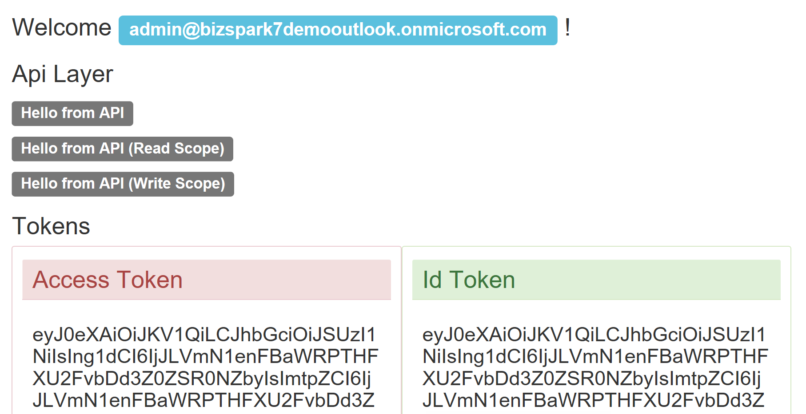

# Demo - Azure AD Secured Api Access (Asp.Net Core 2.0)

Small example of a two tiers application with a FrontEnd application that calls a backend Api application. Both coded with **Asp.Net Core 2.0** and secured with the same Azure Ad tenant (directory).
This demonstrate how to retrieve an access token from AzureAd, using the implicit flow (**OpenIdConnect**):


## Document
For more detailed information read the following [post](https://blogs.msdn.microsoft.com/gianlucb/2017/10/04/access-an-azure-ad-secured-api-with-asp-net-core-2-0).

The original code can be found [here](https://github.com/gianlucb/Demo_AAD.2tiers).


## Setup
Using the Azure portal you need to:
+ create two Azure Applications in your tenant
    + FrontEnd
        + Reply Url: [http://localhost:10001/signin-oidc](#)
        + App ID Uri: [http://AAD.2tiers.Web"](#)
    + Api
        + Reply Url: [http://localhost:10000](#)
        + App ID Uri: [http://AAD.2tiers.Api](#)
+ allows the FrontEnd application to access Api (permission tab, add)
+ Edit the manifest of the FrontEnd application and enable the implicit flow (**"oauth2AllowImplicitFlow"**: **true**).

To automated these tasks you can use the powershell script **Create2TiersAADDemo.ps1**.

Last, you must update the **appsettings.json** file with your settings:

```json
    "Domain": "ZZZZZZZZZ.onmicrosoft.com",
    "TenantId": "your tenant ID",
    "ClientId": "your Application ID"
```

for the FrontEnd application also add the Application ID of the Api layer
    
```json
    "TargetApiAppId": "597add50-a83e-4930-8f8f-YYYYYYYY"
```

Browse to [http://localhost:10001](#) and login with an account in your tenant:



## Tips
* Azure refers to the Directory ID (for an AD domain) as the **TenantID**, and refers to the Application ID (for each registered app) as the **ClientID**
* In the properties of both projects, change the App Url to use the ports: **10000** (for the api) and **10001** (for the web). Alternatively, you can modify the ports used during the setup (above)
* Configure the properties of the solution so that both projects are started when debugging. The default is a single startup project
* Either configure IIS (and the solution) to use SSL and modify the above URLs to use HTTPS, or stick to Chrome for debugging. Firefox will get stuck in a redirect loop as a result of the *unsecured site* warning popup
  * If configuring IIS to use SSL, it is easiest if you also modify the ports used in Azure (and the app) to be the ports generated by Visual Studio. A self-signed certificate will be generated if you enable SSL, which will need to be accepted when you first navigate to the application in a browser. If you modify the SSL port manually, you will also need to figure out the certificate process manually ([reference](https://github.com/aspnet/Home/issues/1608))
* With .NET Core, project properties can be configured within the launchSettings.json file (like SSL port, SSL enabled, ...)
* Within Azure, if the app url is modified, you must also update the **Reply URLs** section


